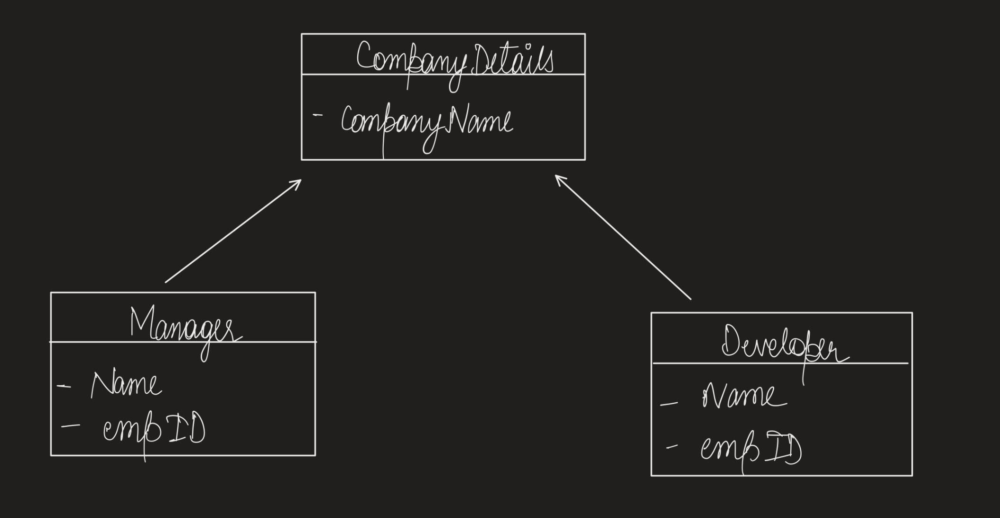

# Composite Design Pattern Example

This repository contains a simple implementation of the Composite design pattern in C#. The Composite pattern is used to compose objects into tree structures to represent part-whole hierarchies. In this example, we have a company directory structure where employees (Developers and Managers) are organized into a hierarchy.

## Files in the Repository

### CompanyDetails.cs
- Defines the `CompanyDetails` class, which represents a company's details within the company directory structure. It contains the company name and a method to display it.

### CompanyDirectory.cs
- Represents a company directory that can contain a list of employees. It provides methods to add employees, print employee details, get the list of employees, and get the size of the company.

### Employee.cs
- Abstract base class for all employees. It defines the `PrintEmployeeDetails` method, which is overridden by concrete employee classes.

### Developer.cs
- Represents a Developer employee with a name and employee ID. It inherits from the `Employee` base class and provides an implementation of the `PrintEmployeeDetails` method.

### Manager.cs
- Represents a Manager employee with a name and employee ID. It also inherits from the `Employee` base class and provides an implementation of the `PrintEmployeeDetails` method.

### UnitTest1.cs
- Contains unit tests for the Composite pattern in the `CompanyDetails` and `CompanyDirectory` classes. It checks whether the company directory correctly maintains the count of employees and displays their details.

## How to Use

The `CompanyDetails` and `CompanyDirectory` classes demonstrate how to create a composite structure for organizing and managing employees within a company.

To run the unit tests and see how the Composite pattern is applied, execute the test methods defined in `UnitTest1.cs`. These tests showcase the functionality of the Composite pattern in the context of managing employees in a company directory.

